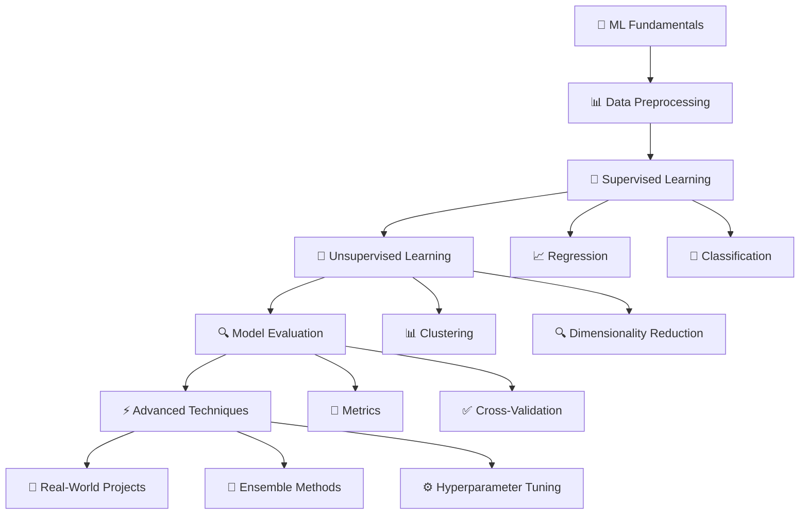

# 🐍 Python Machine Learning: A Beginner's Guide to Scikit-Learn 📚

<div align="center">


**📖 Official Code Repository for "Python Machine Learning: A Beginner's Guide to Scikit-Learn"**

*Master Machine Learning with hands-on examples and real-world projects*

[📚 Get the Book](https://www.amazon.com/dp/B0BXFS9QGN) • [🚀 Quick Start](#-quick-start) • [📖 Chapters](#-chapter-overview) • [💻 Setup](#-installation--setup)

</div>

---

## 🌟 About This Repository

Welcome to the **official companion repository** for "*Python Machine Learning: A Beginner's Guide to Scikit-Learn*" by **Rajender Kumar**. This repository contains all the **interactive code examples**, **datasets**, and **practical exercises** featured in the book.

### 🎯 What You'll Learn



---

## 📖 About the Book

<div align="center">

</div>

**"Python Machine Learning: A Beginner's Guide to Scikit-Learn"** is your gateway to the exciting world of machine learning. This comprehensive guide transforms complex ML concepts into digestible, practical knowledge through:

### 🌟 Key Features

| Feature | Description |
|---------|-------------|
| 🎓 **Beginner-Friendly** | Step-by-step explanations with no prior ML experience required |
| 🛠️ **Hands-On Approach** | Learn by doing with real datasets and practical examples |
| 📊 **Scikit-Learn Focus** | Master the most popular ML library in Python |
| 🔬 **Real-World Projects** | Apply your knowledge to solve actual business problems |
| 📈 **Progressive Learning** | Build knowledge systematically from basics to advanced topics |

---

## 🗂️ Repository Structure

```
📁 Python-Machine-Learning-Scikit-Learn/
├── CHAPTER 2 PYTHON A BEGINNER S OVERVIEW .ipynb
├── CHAPTER 3 DATA PREPARATION .ipynb
├── CHAPTER 4 SUPERVISED LEARNING .ipynb
├── CHAPTER 5 UNSUPERVISED LEARNING.ipynb
├── CHAPTER 6 DEEP LEARNING.ipynb
├── CHAPTER 7 MODEL SELECTION AND EVALUATION .ipynb
├── CHAPTER 8 THE POWER OF COMBINING ENSEMBLE LEARNING METHODS.ipynb
├── DATA
    ├── example_data.csv
    ├── example_missing_data.csv
    └── house-prices.csv
├── README.md
├── Stackoverflow Test.ipynb
├── model.pkl
├── random_forest.joblib
└── requirement.txt
```

---

## 📚 Chapter Overview

### 🔰 Chapter 1: Introduction to Machine Learning
- 🌟 What is Machine Learning?
- 🧠 Types of Machine Learning
- 🐍 Python Environment Setup
- 📊 Introduction to Scikit-Learn

### 📊 Chapter 2: Data Preprocessing
- 🧹 Data Cleaning Techniques
- 🔧 Feature Engineering
- 📏 Data Scaling and Normalization
- 🎯 Handling Missing Values

### 🤖 Chapter 3: Supervised Learning
- 📈 **Regression Algorithms**
  - Linear Regression
  - Polynomial Regression
  - Ridge & Lasso Regression
- 🎯 **Classification Algorithms**
  - Logistic Regression
  - Decision Trees
  - Random Forest
  - Support Vector Machines

### 🧠 Chapter 4: Unsupervised Learning
- 📊 **Clustering**
  - K-Means Clustering
  - Hierarchical Clustering
  - DBSCAN
- 🔍 **Dimensionality Reduction**
  - Principal Component Analysis (PCA)
  - t-SNE

### ⚡ Chapter 5: Advanced Topics
- 🌳 Ensemble Methods
- ⚙️ Hyperparameter Tuning
- 🔄 Cross-Validation
- 🛠️ Pipeline Creation

### 🚀 Chapter 6: Real-World Projects
- 🏠 House Price Prediction
- 👥 Customer Segmentation
- 💭 Sentiment Analysis

---

## 🛠️ Installation & Setup

### 📋 Prerequisites

Make sure you have **Python 3.8+** installed on your system.

### 🚀 Quick Start

1️⃣ **Clone the Repository**
```bash
git clone https://github.com/JambaAcademy/Python-Machine-Learning-A-Beginners-Guide-to-Scikit-Learn-Book-Code.git
cd Python-Machine-Learning-A-Beginners-Guide-to-Scikit-Learn-Book-Code
```

2️⃣ **Create Virtual Environment** (Recommended)
```bash
# Using venv
python -m venv ml_env
source ml_env/bin/activate  # On Windows: ml_env\Scripts\activate

# Using conda
conda create -n ml_env python=3.8
conda activate ml_env
```

3️⃣ **Install Dependencies**
```bash
# Using pip
pip install -r requirements.txt

# Using conda
conda env create -f environment.yml
```

4️⃣ **Launch Jupyter Notebook**
```bash
jupyter notebook
```

### 📦 Required Libraries

| Library | Version | Purpose |
|---------|---------|---------|
|  | `>=1.21.0` | Numerical computing |
|  | `>=1.3.0` | Data manipulation |
|  | `>=3.4.0` | Data visualization |
|  | `>=0.11.0` | Statistical visualization |
|  | `>=1.0.0` | Machine learning |
|  | `>=2.8.0` | Deep learning |
|  | `>=2.8.0` | Neural networks |
|  | `>=1.0.0` | Interactive notebooks |

---

## 🎯 Learning Path


### 📅 Suggested Timeline

| Week | Focus Area | Time Investment |
|------|------------|----------------|
| **Week 1-2** | 🔰 Fundamentals & Setup | 5-7 hours/week |
| **Week 3-4** | 📊 Data Preprocessing | 6-8 hours/week |
| **Week 5-7** | 🤖 Supervised Learning | 8-10 hours/week |
| **Week 8-9** | 🧠 Unsupervised Learning | 6-8 hours/week |
| **Week 10-11** | ⚡ Advanced Techniques | 8-10 hours/week |
| **Week 12-14** | 🚀 Real-World Projects | 10-12 hours/week |

---

## 💡 Interactive Examples

Each chapter includes interactive Jupyter notebooks with:

- 📝 **Step-by-step explanations**
- 💻 **Runnable code examples**
- 📊 **Visualizations and plots**
- 🧪 **Hands-on exercises**
- 🎯 **Real-world applications**

### 🔥 Featured Projects

#### 🏠 Project 1: House Price Prediction
```python
# Predict house prices using regression techniques
from sklearn.ensemble import RandomForestRegressor
from sklearn.metrics import mean_absolute_error

# Load and preprocess data
X_train, X_test, y_train, y_test = prepare_housing_data()

# Train model
model = RandomForestRegressor(n_estimators=100, random_state=42)
model.fit(X_train, y_train)

# Make predictions
predictions = model.predict(X_test)
mae = mean_absolute_error(y_test, predictions)
print(f"Mean Absolute Error: ${mae:,.2f}")
```

#### 👥 Project 2: Customer Segmentation
```python
# Segment customers using K-Means clustering
from sklearn.cluster import KMeans
from sklearn.preprocessing import StandardScaler

# Standardize features
scaler = StandardScaler()
X_scaled = scaler.fit_transform(customer_data)

# Apply K-Means
kmeans = KMeans(n_clusters=4, random_state=42)
clusters = kmeans.fit_predict(X_scaled)

# Analyze segments
analyze_customer_segments(customer_data, clusters)
```

---

## 🤝 How to Use This Repository

### 🎯 For Beginners
1. Start with **Chapter 1** to understand ML fundamentals
2. Follow the chapters **sequentially**
3. Complete all **exercises** and **experiments**
4. Try **modifying the code** to see different results

### 🔥 For Experienced Developers
1. Jump to specific **topics of interest**
2. Use as a **reference guide**
3. Explore **advanced projects**
4. Contribute **improvements** or **new examples**

### 🏫 For Educators
1. Use notebooks as **teaching materials**
2. Assign **projects** to students
3. Customize **examples** for your curriculum
4. Fork and **adapt** for your needs

---

## 📊 Datasets Included

| Dataset | Description | Use Case | Size |
|---------|-------------|----------|------|
| 🏠 **Housing Prices** | Real estate data | Regression | 1,460 rows |
| 🛍️ **Customer Data** | E-commerce customers | Clustering | 2,000 rows |
| 🌸 **Iris Flowers** | Classic ML dataset | Classification | 150 rows |
| 📱 **Product Reviews** | Text sentiment data | NLP/Sentiment | 5,000 rows |
| 📈 **Stock Prices** | Financial time series | Time Series | 1,000+ rows |

---

## 🎓 Learning Outcomes

After completing this book and repository, you will be able to:

### 🔰 Fundamental Skills
- ✅ Understand core ML concepts and terminology
- ✅ Set up Python environment for ML projects
- ✅ Navigate and use Scikit-Learn effectively

### 📊 Data Skills
- ✅ Clean and preprocess real-world datasets
- ✅ Handle missing values and outliers
- ✅ Perform feature engineering and selection

### 🤖 Modeling Skills
- ✅ Build regression and classification models
- ✅ Apply clustering and dimensionality reduction
- ✅ Evaluate and improve model performance

### 🚀 Advanced Skills
- ✅ Create ML pipelines
- ✅ Tune hyperparameters systematically
- ✅ Deploy models for production use

---

## 🛟 Getting Help

### 💬 Community Support
- 📧 **Email**: support@jambaacademy.com
- 💻 **GitHub Issues**: [Report bugs or ask questions](https://github.com/JambaAcademy/Python-Machine-Learning-A-Beginners-Guide-to-Scikit-Learn-Book-Code/issues)
- 🐦 **Twitter**: [@JambaAcademy](https://twitter.com/JambaAcademy)

### 📚 Additional Resources
- 📖 [Scikit-Learn Documentation](https://scikit-learn.org/)
- 🎓 [Python.org Tutorial](https://docs.python.org/3/tutorial/)
- 📊 [Pandas Documentation](https://pandas.pydata.org/docs/)
- 📈 [Matplotlib Gallery](https://matplotlib.org/stable/gallery/)

---

## 🤝 Contributing

We welcome contributions! Here's how you can help:

### 🛠️ Ways to Contribute
- 🐛 **Report bugs** or typos
- 💡 **Suggest improvements**
- 📝 **Add new examples**
- 🌐 **Translate content**
- 📖 **Improve documentation**

### 🔄 Contribution Process
1. 🍴 **Fork** the repository
2. 🌿 **Create** a feature branch
3. ✨ **Make** your changes
4. 🧪 **Test** your code
5. 📤 **Submit** a pull request

---

## 📜 License

This project is licensed under the **MIT License** - see the [LICENSE](LICENSE) file for details.

```
MIT License

Permission is hereby granted, free of charge, to any person obtaining a copy
of this software and associated documentation files (the "Software"), to deal
in the Software without restriction, including without limitation the rights
to use, copy, modify, merge, publish, distribute, sublicense, and/or sell
copies of the Software...
```

---

## 🙏 Acknowledgments

### 👨‍🎓 Author
**Rajender Kumar** - *Machine Learning Engineer & Educator*
- 🌐 Website: [JambaAcademy.com](https://jambaacademy.com)
- 📧 Email: rajender@jambaacademy.com
- 🐦 Twitter: [@RajenderKumar](https://twitter.com/rajenderkumar)

### 🎉 Special Thanks
- 🧠 **Scikit-Learn Team** for the amazing library
- 🐍 **Python Community** for continuous support
- 📚 **Readers & Students** who make this journey worthwhile

---

## ⭐ Show Your Support

If this repository helped you learn machine learning, please:

1. ⭐ **Star** this repository
2. 🍴 **Fork** it for your own projects
3. 📱 **Share** with fellow learners
4. 📝 **Write a review** of the book

---

<div align="center">

### 🚀 Ready to Start Your ML Journey?

[📚 Get the Book](https://www.amazon.com/dp/B0BXFS9QGN) • [💻 Clone Repository](https://github.com/JambaAcademy/Python-Machine-Learning-A-Beginners-Guide-to-Scikit-Learn-Book-Code.git) • [🎓 Start Learning](#-quick-start)

**Happy Learning! 🎉**

---

*"The best way to learn machine learning is by doing. Let's build something amazing together!"*

</div>
